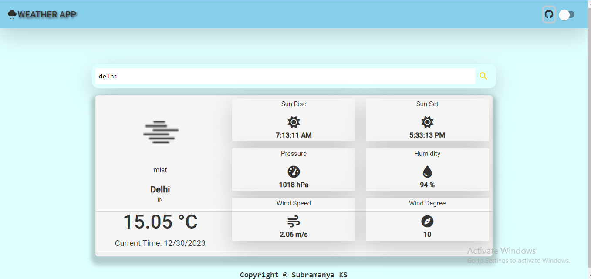
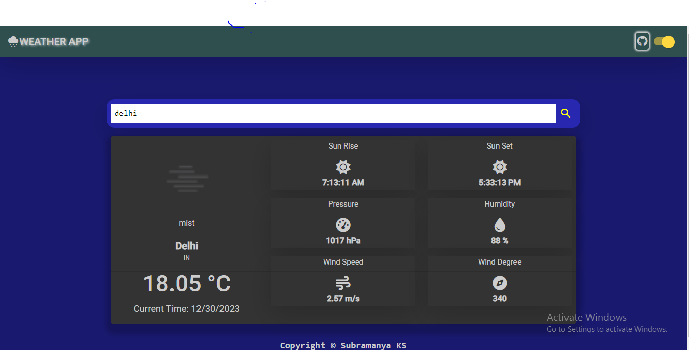

# WeatherApp

A Simple Weather App using Angular and openweathermap API

#### API

The Application Programming Interface is a set of rules and regulations and standards that allows software programs to interact with each other. It acts as a middleman between two applications, allowing them to exchange data and information

## Technology Used
* Angular
* Node Js
* Angular Material

## Features

- The application features a robust search functionality for user-friendly access.
- Ensuring a seamless experience, the UI is responsive and adapts to various devices and screen sizes.
- Users can expect precise and reliable results when utilizing the search feature.
- Current weather conditions, encompassing temperature, humidity, wind speed, and a detailed weather description, are prominently displayed.
- The application efficiently retrieves weather data by accepting a manually entered city name.

## Pre Requisite

This project was generated with [Angular CLI](https://github.com/angular/angular-cli) version 14.2.6.

* Install 
* Installation of [](https://nodejs.org/en/) is mandatory with 
* Login in to [Openweathermap](https://openweathermap.org/api) api website to get your `API key`

## Getting Started

To run this project locally, follow these steps:

1. Clone the repository:

   ```bash
    git clone https://github.com/SubramanyaKS/Angular-Weather-App.git

   ```
2. Navigate to the project directory:

    ```bash
    cd Angular-Weather-App
    ```
3. Install dependencies:

```bash
npm install

```
4. Obtain an API key from OpenWeatherMap and replace `YOUR_API_KEY` in the code with your actual API key.

5. Start the development server:
```bash
ng serve
```

6. Open your browser and navigate to http://localhost:4200/ to view the app.

## Contribution

We welcome contributions! If you'd like to contribute to React-News-App, please follow our [Contribution Guidelines](https://github.com/SubramanyaKS/Angular-Weather-App/blob/main/CONTRIBUTING.md).

## Screenshot





## Credits

[Openweathermap API](https://openweathermap.org/api)
[Fontawesome Icons](https://fontawesome.com/v6/icons)
[Angular CLI ](https://angular.io/cli)

## Feedback

If you have any feedback, please reach out to me at [email](connectwithsubbu@gmail.com)

If you like this don't forget to ⭐ the repository.

